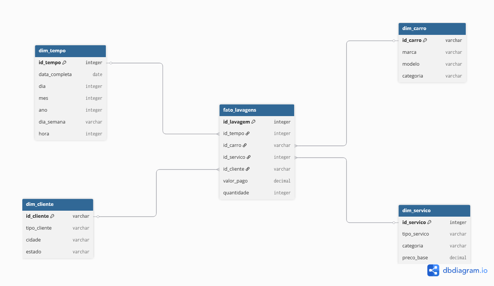

# Projeto de Análise de Dados: Data Mart Lava Jato

## Visão Geral
Este projeto tem como objetivo estruturar um ambiente analítico completo para um lava jato, permitindo a extração de insights relevantes sobre faturamento, volume de serviços e comportamento ao longo do tempo. A solução parte da geração de dados brutos (mockados), passa por um pipeline ETL via Python e finaliza na construção de um banco de dados dimensional com Data Marts agregados.

## Objetivos do Projeto
* Calcular o faturamento médio e total do lava jato ao longo do tempo.
* Identificar o desvio padrão do faturamento, destacando variações e instabilidades no caixa.
* Detectar meses com baixa atividade (meses parados) e analisar a sazonalidade semanal.
* Analisar o volume médio diário de carros lavados por mês.
* Apoiar decisões estratégicas para aumentar a receita e a eficiência operacional.

## Modelagem de Dados
O projeto utiliza um modelo dimensional inspirado no **Star Schema**, com separação clara entre fatos e dimensões. 



**Granularidade:** A granularidade da Tabela Fato é de **um registro por serviço executado** (1 linha = 1 serviço realizado em 1 carro, em 1 dia específico).

### Tabela Fato
* **Fato_Lavagens:** `ID_Lavagem`, `ID_Carro`, `ID_Servico`, `ID_Tempo`, `Valor_Pago`, `Quantidade`

### Dimensões
* **Dim_Carro:** `ID_Carro`, `Modelo`, `Marca`, `Categoria` (Pequeno, Médio, Grande)
* **Dim_Servico:** `ID_Servico`, `Tipo_Servico`, `Preco_Base`, `Categoria_Servico`
* **Dim_Cliente:** `ID_Cliente`, `Nome_Cliente`, `Cidade`, `Estado`, `Tipo_Cliente`
* **Dim_Tempo:** `ID_Tempo`, `Data`, `Dia`, `Mes`, `Ano`, `Dia_da_Semana`, `Fim_de_Semana` (Gerada dinamicamente via ETL)

## Pipeline ETL e Data Marts Agregados
O pipeline foi construído em Python (Pandas e SQLAlchemy). Os dados transacionais brutos foram gerados via biblioteca `Faker`. Durante a fase de transformação, a `Dim_Tempo` foi extraída a partir das datas da tabela fato. 

Além do modelo base, o pipeline gera fisicamente no banco de dados (`SQLite`) os seguintes Data Marts agregados para facilitar a visualização:
1. **dm_financeiro:** Faturamento total consolidado por ano, mês e tipo de serviço.
2. **dm_operacional:** Total de lavagens agregadas detalhadamente por data, hora e dia da semana.
3. **dm_cliente:** Quantidade de lavagens realizadas, cruzadas por mês e categoria do veículo.
4. **dm_serviços:** Volume de atendimentos e faturamento total agregados por tipo e categoria de serviço.

## 5 Perguntas de Negócio Resolvidas (Queries SQL)

**1. Qual é o faturamento total e o volume de lavagens por mês?**
```sql
SELECT 
    t.Ano, 
    t.Mes, 
    COUNT(f.ID_Lavagem) AS total_lavagens, 
    ROUND(SUM(f.Valor_Pago), 2) AS faturamento_total
FROM fato_lavagens f
JOIN dim_tempo t ON f.ID_Tempo = t.ID_Tempo
GROUP BY t.Ano, t.Mes
ORDER BY t.Ano, t.Mes;
```

**2. Qual é a média diária de carros lavados em cada mês?**
```sql
SELECT 
    Ano,
    Mes, 
    ROUND(AVG(qtd_dia), 2) AS media_diaria_carros
FROM (
    SELECT 
        t.Ano, t.Mes, t.Data, 
        COUNT(f.ID_Lavagem) AS qtd_dia
    FROM fato_lavagens f
    JOIN dim_tempo t ON f.ID_Tempo = t.ID_Tempo
    GROUP BY t.Ano, t.Mes, t.Data
) sub
GROUP BY Ano, Mes
ORDER BY Ano, Mes;
```

**3. Existe sazonalidade semanal no negócio (quais os dias de maior movimento)?**
*(Nota: Dia 0 = Segunda-feira, 6 = Domingo)*
```sql
SELECT 
    t.Dia_da_Semana, 
    COUNT(f.ID_Lavagem) AS total_lavagens, 
    ROUND(SUM(f.Valor_Pago), 2) AS faturamento_total
FROM fato_lavagens f
JOIN dim_tempo t ON f.ID_Tempo = t.ID_Tempo
GROUP BY t.Dia_da_Semana
ORDER BY total_lavagens DESC;
```

**4. Quais tipos de serviços geram a maior parte da receita?**
```sql
SELECT 
    s.Tipo_Servico, 
    COUNT(f.ID_Lavagem) AS qtd_executada, 
    ROUND(SUM(f.Valor_Pago), 2) AS faturamento_total
FROM fato_lavagens f
JOIN dim_servico s ON f.ID_Servico = s.ID_Servico
GROUP BY s.Tipo_Servico
ORDER BY faturamento_total DESC;
```

**5. Qual é o perfil da frota atendida (Categoria do Carro) e seu impacto na receita?**
```sql
SELECT 
    c.Categoria AS porte_do_carro, 
    COUNT(f.ID_Lavagem) AS total_lavagens, 
    ROUND(SUM(f.Valor_Pago), 2) AS faturamento_total
FROM fato_lavagens f
JOIN dim_carro c ON f.ID_Carro = c.ID_Carro
GROUP BY c.Categoria
ORDER BY faturamento_total DESC;
```

## Como Executar o Projeto
1. Clone este repositório com python= 3.12 .
2. Instale as dependências executando: `pip install pandas faker sqlalchemy`
3. Execute o script `mock_data_generator.py` para gerar os dados brutos em CSV.
4. Execute o script `etl_pipeline.py` para realizar as transformações, criar a dimensão tempo dinamicamente e salvar o modelo dimensional e os Data Marts no banco de dados local `lavajato_datamart.db`.
5. Conecte o banco de dados `lavajato_datamart.db` à sua ferramenta de visualização (ex: Power BI via ODBC, Metabase, ou DB Browser).

## Tecnologias Utilizadas
* **Extração e Transformação (ETL):** Python (Pandas, Faker)
* **Armazenamento e Carga:** SQLite (via SQLAlchemy)
